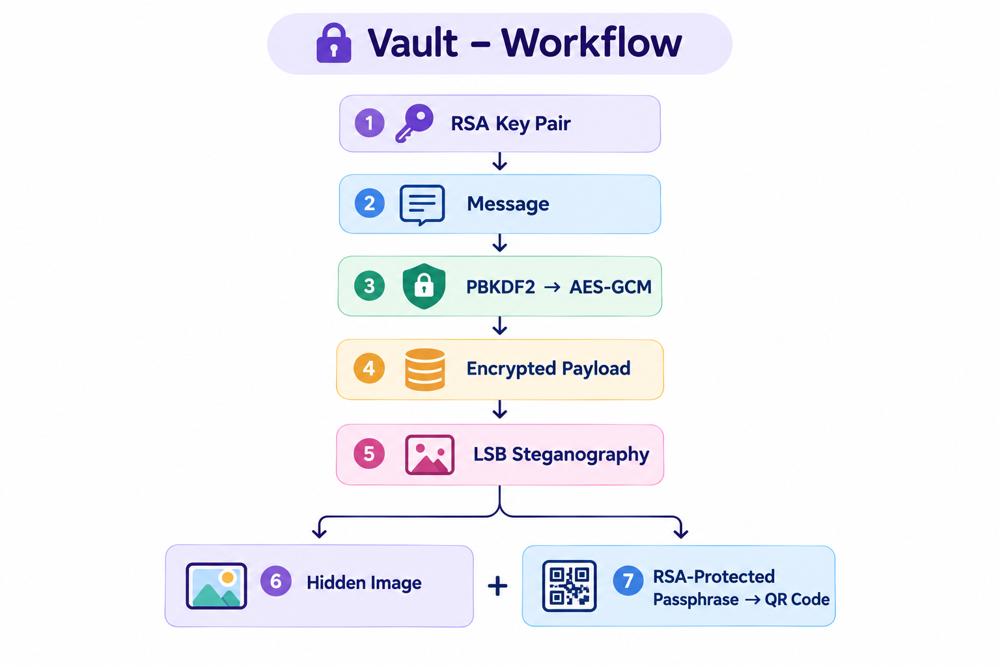
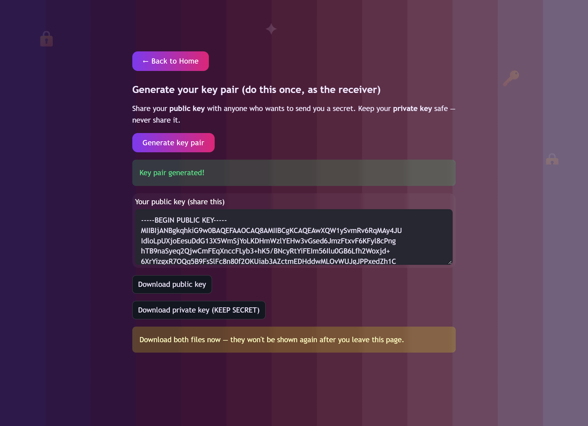
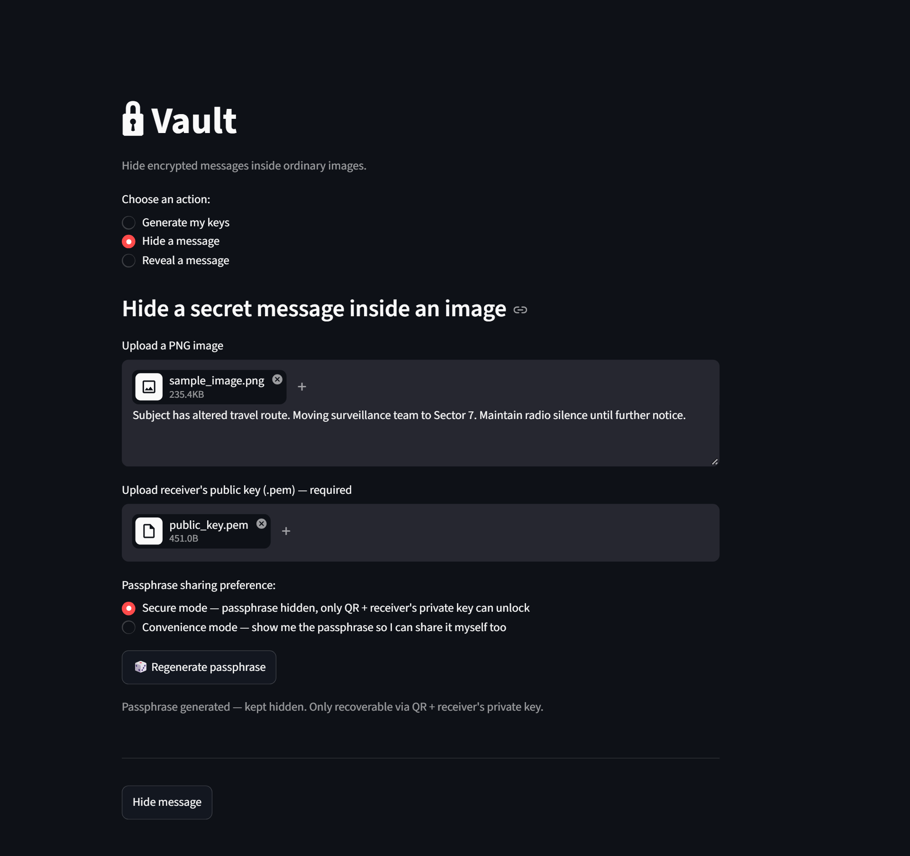
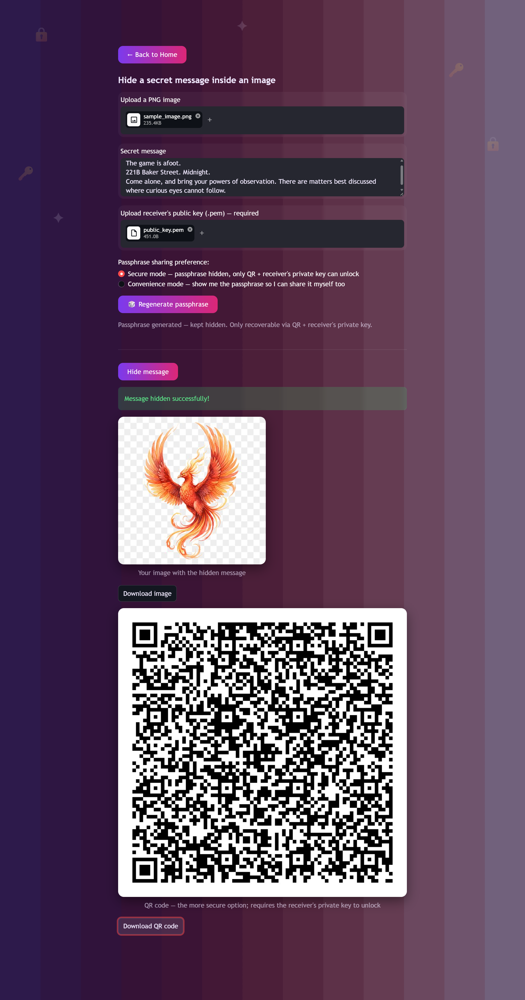
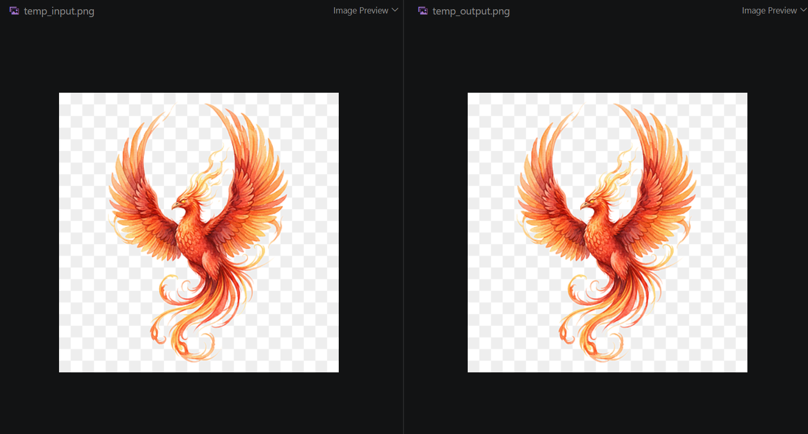

# 🔒 Vault — Hide Encrypted Messages Inside Ordinary Images

**What if your secret message didn't have to look like a secret?**

Vault combines **AES-GCM encryption, RSA public-key cryptography, and image steganography** to hide an encrypted message inside an ordinary PNG image.

Built for the FirstCommit hackathon.
## 🚀 Live Demo

Try Vault live here:

👉 **[Launch Vault](https://vault-stego-bezmbblrdj2x4mgwbgit6m.streamlit.app/)**

> No installation required — open the app and try hiding and revealing a message.

## 🎥 Demo Video

[Watch the 40-second demo](YOUR_DEMO_VIDEO_LINK)

## The Problem

I started thinking about this from a simple question:

**What if I need to send someone something private, but I don't even want the message itself to attract attention?**

Encryption solves the first part. It makes the message unreadable without the right key. But an encrypted file still looks like an encrypted file. Anyone who sees it knows there's probably something worth hiding.

Sometimes, the safest-looking message isn't a message that looks encrypted at all.

It's a completely ordinary photo.

That's the idea behind Vault — hide the encrypted message inside an ordinary image using steganography. To everyone else, it looks like just another picture. For the intended receiver, there's a secret waiting underneath.

Because sometimes, security isn't only about hiding the information. It's about hiding the existence of the information itself.

## Why I Built Vault

Vault started with a simple question:

**What if a message could be kept private without making it look private?**

When we think about secure communication, we usually think about encryption — making the contents unreadable to anyone without the key. But that still leaves a visible signal that something has been protected.

That made me curious about the other side of security: hiding the existence of the message itself.

So I built Vault as a way to explore that idea by combining encryption and steganography. Instead of sending a file that obviously looks encrypted, the sender can share an ordinary-looking image containing a hidden, encrypted message.

What started as a question became a hands-on way for me to understand how AES-GCM, PBKDF2, RSA, key handling, QR-based key sharing, and LSB steganography can work together in one system.

## How It Works

1. **You write a secret message** and the app generates a strong, memorable passphrase using a diceware-style technique (random real words, not gibberish).

2. **The message is encrypted** with AES-GCM, using a key derived from that passphrase (PBKDF2, 200,000 iterations, unique salt per message).

3. **The encrypted message is hidden inside a PNG image** using LSB (Least Significant Bit) steganography — invisible to the eye, changes 1 bit per color channel per pixel.

4. **The passphrase itself is protected** using the receiver's RSA public key, then turned into a QR code — so only someone with the matching private key can ever recover it.

5. The sender ends up with **two separate files** — the image and the QR code — meant to be sent through two different channels. Even if someone intercepts both, they can't unlock the message without the receiver's private key.

```text
Private key → unlocks → passphrase (via QR) → unlocks → hidden message (via image)
````



This is a **hybrid encryption** design — the same pattern used by real-world systems like Signal and PGP: fast symmetric encryption (AES) protects the bulk data, while slower asymmetric encryption (RSA) protects only the small key that unlocks it.

## Features

* 🖼️ Hide any text message inside a PNG image (invisible to the eye)

* 🔑 Real AES-GCM encryption with PBKDF2 key derivation

* 🎲 Cryptographically secure diceware-style passphrase generator

* 🔐 RSA public/private key pair generation

* 📱 QR-code-based secure passphrase sharing

* ⚖️ Two sharing modes: **Secure** (QR + private key only) and **Convenience** (plain passphrase, with QR as a backup option)

* ✅ Built-in validation: wrong passphrase, wrong image, wrong key, or oversized message all fail safely with clear errors

## Screenshots

**Generating your key pair:**



**Hiding a message:**



**Output: hidden image + QR code:**



**Revealing a message:**


**Before vs. after — visually identical:**



## Tech Stack

* **Python** — core language

* **Streamlit** — web UI

* **Pillow** — image handling

* **cryptography** — AES-GCM, PBKDF2, RSA/OAEP

* **qrcode** — QR code generation

* **OpenCV** — QR code scanning/decoding

## Setup Instructions

```bash
git clone <your-repo-url>

cd vault-stego

python -m venv venv

venv\Scripts\activate          # Windows
# source venv/bin/activate     # Mac/Linux

pip install -r requirements.txt

streamlit run app.py
```

The app opens in your browser automatically.

## Usage

1. **Generate my keys** — the receiver generates a public/private key pair once, and shares the public key with anyone who wants to send them a secret.

2. **Hide a message** — the sender uploads an image, writes their message, uploads the receiver's public key, and chooses Secure or Convenience mode. Downloads the resulting image + QR code.

3. **Reveal a message** — the receiver uploads the image, and either types the passphrase directly, or uploads the QR code + their own private key to decrypt it automatically.

## What I Learned

Building this taught me several real security concepts I hadn't worked with hands-on before:

* **Symmetric vs. asymmetric encryption**, and why real systems use both together (hybrid encryption) instead of just one

* **Why key derivation matters** — turning a human passphrase into a proper encryption key safely (PBKDF2, salting)

* **Authenticated encryption** (AES-GCM) — encryption that also detects tampering, instead of silently returning garbage on a wrong key

* **LSB steganography** — how hiding data in the least significant bits of pixel values keeps an image visually unchanged

* **Why `secrets` isn't `random`** — Python's `random` module is predictable and unsuitable for anything security-related

* Debugging real integration issues between multiple cryptographic layers (QR scanning, RSA padding, session state handling in Streamlit)

## Known Limitations

* **Key exchange is out of scope**: this project assumes the receiver's public key reaches the sender through a channel they already trust (e.g., shared in person or another secure app). Solving secure key exchange from scratch is a much larger problem — the same one HTTPS/TLS exists to solve.

* **No sender authentication**: currently, anyone with the receiver's public key can send them a message — there's no way for the receiver to verify who actually sent it. This could be solved with digital signatures (the sender signing the message with their own private key) as a future improvement.

* **Private key file is not password-protected** in the current version — it's downloaded as a plain `.pem` file. A production version would encrypt this file with its own password.

* **PNG only**: JPEG isn't supported, since its lossy compression would destroy the hidden data.

## AI Usage Disclosure

This project was built with significant AI assistance (Claude, by Anthropic) as a learning aid — helping explain cryptographic concepts, debug integration issues, and structure the code. All design decisions, architecture choices, and understanding of how each piece works were driven and reviewed by me throughout the build.

## Author

Built by **Krithika Shree Karthikeyan** for the Beginner's Paradise - FirstCommit hackathon (2026).

* GitHub: [krithikashree1957](https://github.com/krithikashree1957)

* Devpost: [Krithika Shree Karthikeyan's Devpost Portfolio](https://devpost.com/krithikashree1957?ref_content=user-portfolio&ref_feature=portfolio&ref_medium=global-nav&utm_source=gemini)

